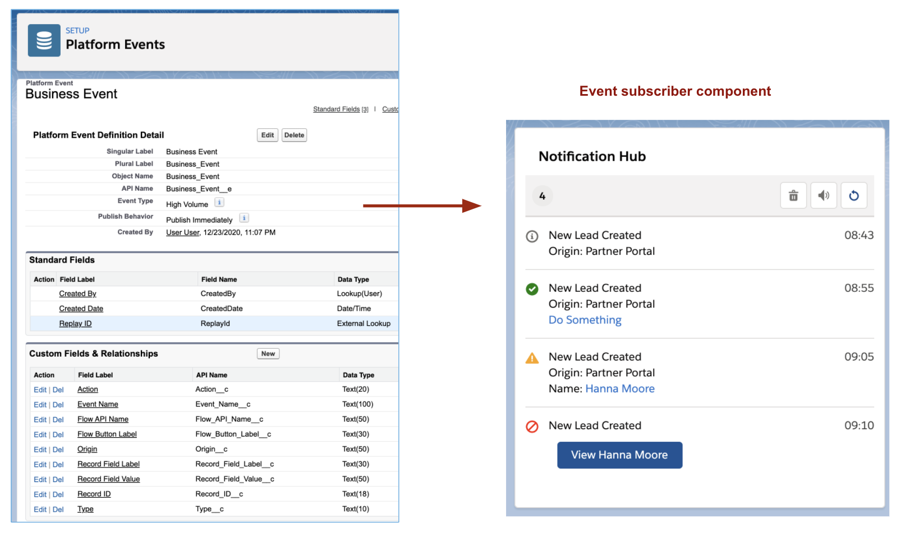

## sfdx-platform-event-notifications

*RC_BusinessEvent_NotificationConsole* is an Aura Lightning component that:

1. Subscribes to a custom platform event channel
2. Displays notifications when Business Event platform events are received - in a toast pop-up message and as a list within the component.
3. Past events can be replayed from the event channel.
4. A history of events can be replayed from stored Business Event custom object records.

## Development

To work on this project in a scratch org:

1. [Set up CumulusCI](https://cumulusci.readthedocs.io/en/latest/tutorial.html)
2. Run `cci flow run dev_org --org dev` to deploy this project.
3. Run `cci org browser dev` to open the org in your browser.

## Deploy

This project depends on the lightning component **RC_FlowButton** in https://github.com/SFDC-Assets/rc-flow-components

If using CumulusCI to deploy this project, the dependent project will be deployed automatically as an unmanaged package. 